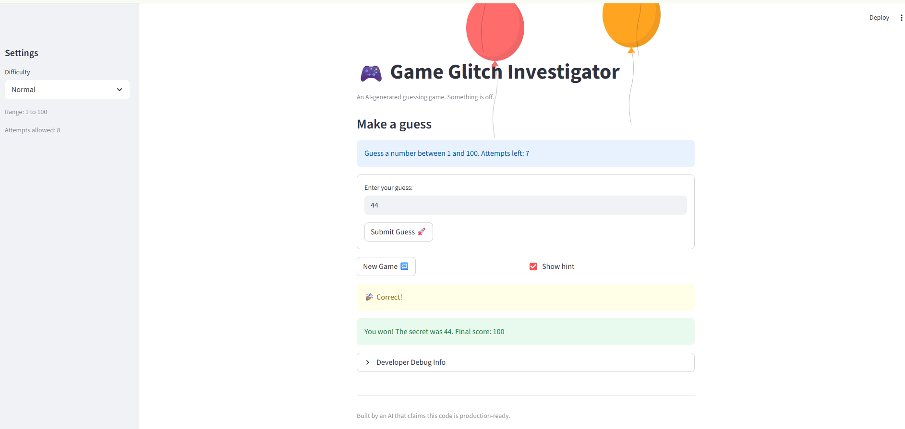
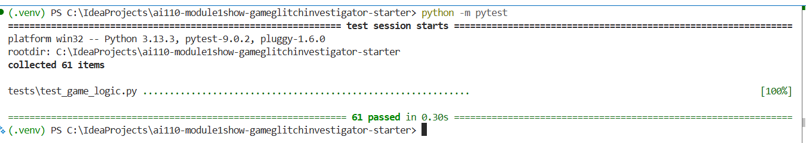
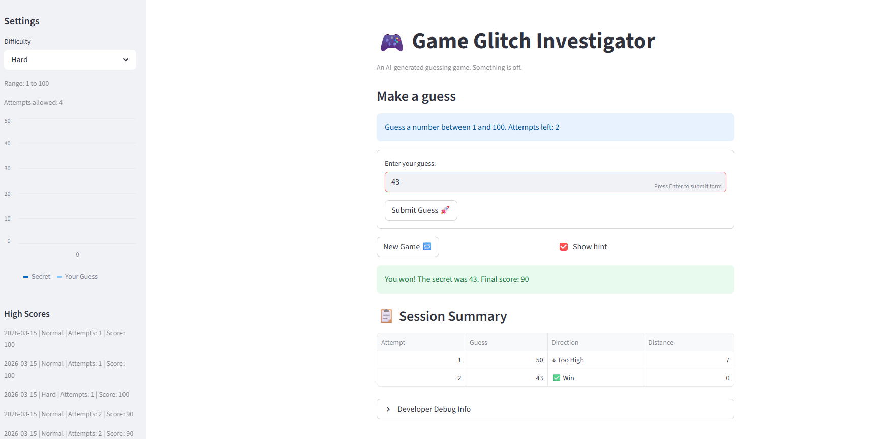

# 🎮 Game Glitch Investigator: The Impossible Guesser

## 🚨 The Situation

You asked an AI to build a simple "Number Guessing Game" using Streamlit.
It wrote the code, ran away, and now the game is unplayable. 

- You can't win.
- The hints lie to you.
- The secret number seems to have commitment issues.

## 🛠️ Setup

1. Install dependencies: `pip install -r requirements.txt`
2. Run the broken app: `python -m streamlit run app.py`

## 🕵️‍♂️ Your Mission

1. **Play the game.** Open the "Developer Debug Info" tab in the app to see the secret number. Try to win.
2. **Find the State Bug.** Why does the secret number change every time you click "Submit"? Ask ChatGPT: *"How do I keep a variable from resetting in Streamlit when I click a button?"*
3. **Fix the Logic.** The hints ("Higher/Lower") are wrong. Fix them.
4. **Refactor & Test.** - Move the logic into `logic_utils.py`.
   - Run `pytest` in your terminal.
   - Keep fixing until all tests pass!

## 📝 Document Your Experience

- [x] Describe the game's purpose.

  Glitchy Guesser is a number-guessing game built with Streamlit where the player tries to identify a secret number between 1 and 100 within a limited number of attempts. On each guess the game provides a directional hint — "Go Higher" or "Go Lower" — to guide the player toward the answer. Three difficulty tiers (Easy, Normal, Hard) give the player 10, 8, or 4 attempts respectively, making the game progressively more challenging. A score is calculated based on how quickly the player finds the number, rewarding fewer attempts with a higher score.

  Beyond being a playable game, the project is intentionally shipped with eight bugs as a learning exercise. The student's goal is to act as a "glitch investigator" — play the broken game, identify what's wrong, collaborate with AI tools to diagnose and fix each defect, write pytest cases to verify the fixes, and reflect on the debugging process. This mirrors real-world software development workflows where AI-generated code must be critically reviewed, tested, and corrected before it is production-ready.
- [x] Detail which bugs you found.

  **Defect 1 — Inverted & Unstable Hint Logic** (`logic_utils.py`, `app.py`)
  The hints were backwards: when a guess was too high the game said "Go Higher", and vice versa. A second issue compounded this — `app.py` alternated the type of the secret number between `int` and `str` on every other attempt. In Python 3, comparing `int > str` raises a `TypeError`, causing the hint to flip direction each time the same number was submitted.

  **Defect 2 — Broken "New Game" Button** (`app.py`)
  Clicking New Game reset `attempts` and generated a new secret, but left `status` ("won"/"lost") and `score` unchanged. Because Streamlit's `st.stop()` guard checks `status` immediately on the next rerun, the game was permanently blocked after the first round ended and only a full browser refresh could start a new session.

  **Defect 3 — Desynchronized Attempt Counter** (`app.py`)
  Two compounding problems: `attempts` was initialized to `1` instead of `0`, so the counter opened at N−1 before any guess was made. Additionally, `st.info()` rendered above the submit block, so Streamlit's top-to-bottom execution always displayed the pre-increment value — leaving the counter stuck on the same number after the first guess.

  **Defect 4 — Incorrect Difficulty Scaling** (`app.py`, `logic_utils.py`)
  The attempt map had Easy=6 and Normal=8, making Normal easier than Easy. Separately, `get_range_for_difficulty` returned a narrower number range for Easy (1–20) and Hard (1–50), causing a mismatch: the UI showed 1–100 but the secret and range validation operated on the smaller range, making guesses above 20 invalid on Easy even though the UI allowed them.

  **Defect 5 — Flawed Scoring System** (`logic_utils.py`)
  The win formula used `(attempt_number + 1)` instead of `(attempt_number - 1)`, so a perfect first guess scored 80 instead of 100. Wrong-guess penalties also had no floor, allowing the score to drop into negative numbers if the player exhausted all attempts.

  **Defect 6 — Dead Enter Key** (`app.py`)
  The guess input and submit button were not wrapped in a form, so pressing Enter in the text field did nothing. The player was forced to click the Submit button manually every time.

  **Defect 7 — Missing Input Validation** (`app.py`)
  `parse_guess` only verified the input was a valid number; it never checked whether the value fell within the 1–100 game range. Numbers like −5 or 500 were accepted and processed as real guesses. A follow-up issue: the attempt counter incremented before validation ran, so even an invalid input cost the player an attempt.

  **Defect 8 — Inaccurate Developer Debug History** (`app.py`)
  The debug expander was placed above the submit block, so it always rendered with the state values from the start of the current Streamlit run — one step behind after every submission. Invalid guesses were also appended to the history list as raw strings, mixing types alongside the valid integer guesses.
- [x] Explain what fixes you applied.

  **Defect 1 — Inverted & Unstable Hint Logic**
  - *Issue 1:* Swapped the two return strings in `check_guess` so that `guess > secret` correctly returns "Go LOWER" and `guess < secret` returns "Go HIGHER".
  - *Issue 2:* Removed the `attempt_number % 2 == 0` branch in `app.py` that alternated the secret between `str` and `int`. The secret is now always read directly from `session_state` as an `int` with no type conversion.

  **Defect 2 — Broken "New Game" Button**
  Added `st.session_state.status = "playing"` and `st.session_state.score = 0` to the new-game reset block. Previously only `attempts` and `secret` were reset, leaving `status` in its terminal "won"/"lost" state and causing `st.stop()` to block the game on the very next rerun.

  **Defect 3 — Desynchronized Attempt Counter**
  Changed the `attempts` initialization from `1` to `0`. Replaced the static `st.info()` call above the submit block with an `st.empty()` placeholder that is filled after the submit block executes, so the counter always reflects the post-increment value for the current run.

  **Defect 4 — Incorrect Difficulty Scaling**
  Corrected the `attempt_limit_map` to `Easy=10, Normal=8, Hard=4`. Simplified `get_range_for_difficulty` in `logic_utils.py` to return `1, 100` for every difficulty, eliminating the per-tier ranges that caused Easy and Hard to generate secrets and validate guesses against a narrower window than the UI displayed.

  **Defect 5 — Flawed Scoring System**
  Changed the win-points formula from `100 - 10 * (attempt_number + 1)` to `100 - 10 * (attempt_number - 1)` so a first-attempt win correctly scores 100. Wrapped all penalty return values in `max(0, ...)` to floor the score at zero and prevent it from going negative.

  **Defect 6 — Dead Enter Key**
  Wrapped the guess `st.text_input` and submit button inside an `st.form` / `st.form_submit_button`. Streamlit forms capture the Enter key and submit the form automatically, so players no longer need to click the button manually. The New Game button and Show Hint checkbox were moved outside the form as they have independent behavior.

  **Defect 7 — Missing Input Validation**
  Added a bounds check in `app.py` immediately after `parse_guess` succeeds: `if ok and not (low <= guess_int <= high)`. Out-of-range values are rejected with a clear error message. The `attempts += 1` increment was also moved inside the valid-guess branch so that invalid input — whether a bad format or an out-of-range number — is treated as a free re-entry and does not cost the player an attempt.

  **Defect 8 — Inaccurate Developer Debug History**
  Moved the `st.expander("Developer Debug Info")` block to after the submit block and the `counter_placeholder.info()` call, so all displayed values (attempts, score, history) reflect the fully updated state for the current run. Removed the `history.append(raw_guess)` call for invalid inputs so the history list contains only valid integer guesses.

## 📸 Demo

- [x] [Insert a screenshot of your fixed, winning game here]

## Challenge 1: Advanced Edge-Case Testing

- [x] [Insert a screenshot showing the pytest command being run and the test results with your tests passing ]

## Challenge 2: Feature Expansion via Agent Mode

I used Claude Code in Agent Mode to plan and implement two new features without writing the code manually.

**Feature 1 — High Score Tracker**

The agent designed a persistent leaderboard that writes the top-5 all-time winning scores to `highscores.json` next to `app.py`. It added `load_highscores` and `save_highscore` helper functions at the top of `app.py`, called `save_highscore` on the win branch, and rendered the board in the sidebar. The agent chose JSON over a database to keep the solution self-contained and dependency-free. I reviewed the file I/O logic and the sidebar rendering and confirmed it worked correctly end-to-end before accepting the changes.

**Feature 2 — Guess History Sidebar Chart**

The agent added a live line chart to the sidebar that plots every valid guess the player has made alongside a flat reference line showing the secret number. It used `pandas.DataFrame` to structure the two-column data and called `st.sidebar.line_chart`. The agent placed the chart after the difficulty captions so it only appears once at least one guess has been recorded. I verified the chart updated correctly after each guess and that the secret line remained flat.

**How the agent contributed vs. what I reviewed:**
- The agent autonomously selected the right Streamlit APIs (`st.sidebar.line_chart`, `st.sidebar.caption`), wrote the helper functions, and placed all new code in the correct locations.
- I reviewed each change for correctness, checked that `save_highscore` was inside the win branch (not called on every submit), and confirmed the chart data types matched what `st.sidebar.line_chart` expects.
- I then wrote pytest cases in `TestHighScoreTracker` and `TestGuessHistoryChart` to lock in the expected behavior — the agent's implementation guided exactly which edge cases (empty file, top-5 trimming, history length) to cover.

## Challenge 3: Professional Documentation and Linting
- [x] Use the Generate documentation smart action to add professional-grade docstrings to every function in logic_utils.py.
- [x] Then, ask Copilot to review your code for PEP 8 style compliance and use the Fix with Copilot feature to resolve any formatting or naming suggestions it provides.

## Challenge 4: Enhanced Game UI
- [x] Add structured and user-friendly output to the game such as color-coded hints, emojis for "Hot/Cold" states, or a summary table of the game session (without breaking core game logic).

## 🚀 Stretch Features

- [x] [If you choose to complete Challenge 4, insert a screenshot of your Enhanced Game UI here]
